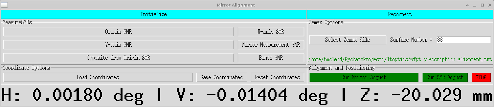

** ltoptics -- Laser Tracker Optics **
The ltoptics package allows accurate placement of flat mirrors and spherically mounted retro-reflectors on an optical 
table based on a Zemax OpticStudio prescription.

# Laser Tracker Optics
The ltoptics package allows accurate placement of flat mirrors and spherically mounted retro-reflectors on an optical 
table to locations specified in a Zemax OpticStudio prescription.

## Description



## Getting Started

### Dependencies

* Assumes a scientific python installation including numpy, tkinter, etc.
* This software has been run on Ubuntu, but in principle can be run on any platform
* The code currently supports the Leica AT4xx laser trackers.  Usage with other laser trackers 
will require development of a light interface to support connection, initializaion, measuring at a specified location, and measuring the current location.
  See the file leica_at4xx.py for an example.
* If using the Leica AT4xx laser tracker you will need to download and install the CESAPI
  package from https://pypi.org/project/CESAPI/

### Installing

* Download and unpack this repo.
* Copy the configuration file wfpt.yaml to your_project.yaml
* Edit ltoptics.py and change the config file name to your_project.yaml

### Configuration file explained

```
laser_tracker:
    type: leica_at4xx
    host: 192.168.1.243
```
The laser_tracker type controls which module will be imported for communications with your laser tracker.
If you have a different type of laser tracker you will need to write your own interface module, e.g. super_lt.py, modeled on the one in leica_at4xx.py

```
Zemax_origin_in_benchcoordinates:
```
These are the coordinates of the Zemax global coordinate reference surface measured in your bench coordinate system.  You'll likely need to measure this in your CAD software.

```Zemax_unitvectors_in_bench_coordinates:[
             [0, 0, 1],
             [0, 1, 0],
             [-1, 0, 0]]
```
This means that the Zemax X coordinate direction is congruent with the bench Z coordinate,
Zemax Y with bench Y, and Zemax Z with bench -X.
```
smrs:
    0:
        name: Origin SMR
        layout_column: 0
        layout_row: 0
    1:
        name: X-axis SMR
        layout_column: 1
        layout_row: 0
```
These define the SMRs that are on your optical bench and the names and where they appear on the GUI.

### Executing program

```
cd your/path/ltoptics
python ltoptics.py
```


### First steps

The first thing that needs to be done is to measure the positions of all the SMRs that are permanently attched to the bench.
Aim the laser tracker at each of the SMRs and press the corresponding button in the GUI.  Once all of them have been measured, press Save.
Use the filename permbench.txt.  This step needs to be done only once but must be done with the laser tracker in a position where it has a sightline to all of the SMRs.

In Zemax OpticStudio you must generate and save a Prescription report in the ltoptics folder.  This should be done in ascii format (the default is Unicode).

## Authors

Brian McLeod, Peyton Benac, Grant Meiners  
Center for Astrophysics | Harvard & Smithsonian


## Version History


* 1.0
    * Initial Release


## Further reading

McLeod, B. et al 2022, Proc SPIE, etc etc.